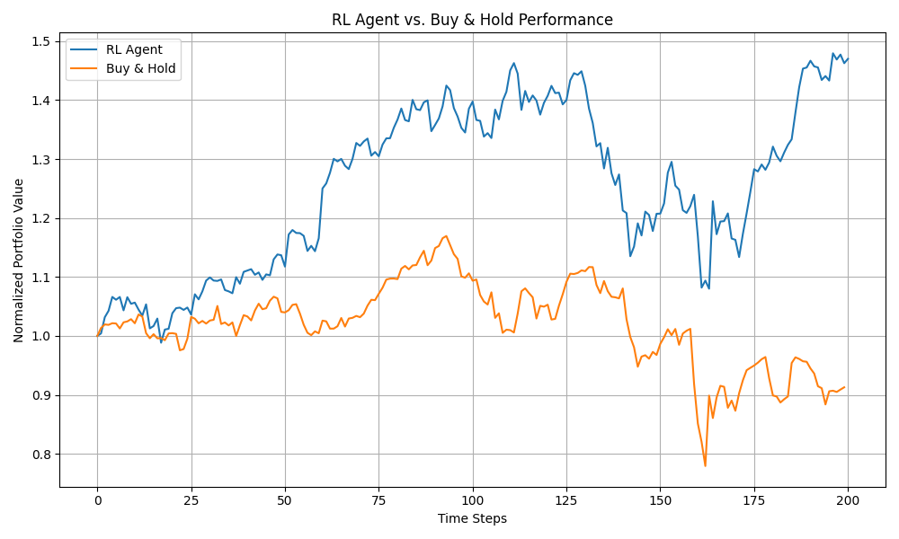
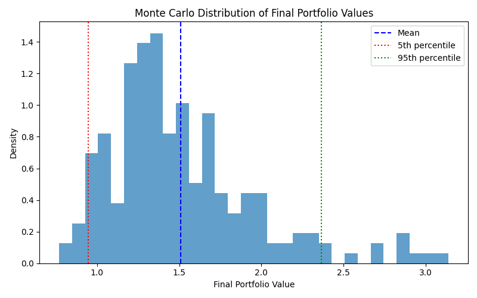

# RL Portfolio Trading Bot

A simple reinforcement learning project for portfolio management. This repository contains:

- **`fetch_data.py`**: Downloads historical adjusted-close price data for 15 well-known S&P 500 tickers (default: 2015-01-01 to present) and saves cleaned `data.csv`.
- **`portfolio_env.py`**: Custom OpenAI Gym environment to simulate portfolio allocation over time with transaction costs.
- **`train.py`**: Trains a Soft Actor-Critic (SAC) agent on `PortfolioEnv`, with checkpointing and evaluation callbacks.
- **`evaluate.py`**: Evaluates a trained model on a hold-out test set and plots equity curves vs. a buy-and-hold benchmark, and computes key performance metrics.
- **`monte_carlo_evaluate.py`**: Runs Monte Carlo simulations by resampling historical returns to assess policy robustness.
- **`.gitignore`**: Excludes Conda environments, caches, and temporary files.

## Prerequisites

- **Conda** (or Miniconda).
- **Python 3.9**.

## Setup

1. Create and activate the environment:
   ```bash
   conda create -n portfolio-rl python=3.9 -y
   conda activate portfolio-rl
   ```
2. Install required packages:
   ```bash
   pip install gym pandas numpy stable-baselines3 yfinance matplotlib shimmy
   ```

## Fetch Historical Data

Run the data-fetch script:

```bash
python fetch_data.py
```

- Generates `data.csv` with price history for selected tickers.
- Prints its shape and first few rows.

## Portfolio Environment

Load and test the custom Gym environment:

```bash
python - <<EOF
import pandas as pd
from portfolio_env import PortfolioEnv

prices = pd.read_csv("data.csv", index_col=0, parse_dates=True)
# 10-day window example
env = PortfolioEnv(prices, window_size=10)
obs = env.reset()
EOF
```

### Smoke Test

Step through a few random actions:

```bash
python - <<EOF
import pandas as pd
from portfolio_env import PortfolioEnv

prices = pd.read_csv("data.csv", index_col=0, parse_dates=True)
env = PortfolioEnv(prices, window_size=10)
obs = env.reset()
for i in range(5):
    action = env.action_space.sample()
    obs, reward, done, info = env.step(action)
    print(f"Step {i+1}: Reward={reward:.4f}, Portfolio Value={info['portfolio_value']:.4f}")
    if done: break
EOF
```

If you see rewards and portfolio values printed without errors, the environment is working correctly.

## Training

Launch SAC training:

```bash
python train.py
```

- Checkpoints saved in `./models/` every 10k steps.
- Best model stored under `./models/best/`.
- Final model at `./models/sac_portfolio_final.zip`.

## Evaluation

After training, evaluate performance on a hold-out test set:

```bash
python evaluate.py
```

This script:
1. Loads the last ~250 trading days of `data.csv`.
2. Instantiates `PortfolioEnv` with a 50-day window.
3. Loads the best SAC model from `./models/best/best_model.zip`.
4. Rolls out a full episode, collecting portfolio values.
5. Computes and prints key metrics:
   - **Cumulative Return** (percentage gain over test period).
   - **Maximum Drawdown** (largest peak-to-trough drop).
   - **Volatility** (standard deviation of log returns).
6. Plots the RL agent’s equity curve versus a buy-and-hold baseline.

### Example Output

Cumulative Return: 47.01%  
Maximum Drawdown: 26.17%  
Volatility (std of log returns): 0.0219



**Interpretation:**
- The SAC agent achieved a 47% gain over the test window, while buy-and-hold delivered modest gains of around 17%.
- Although the agent experienced a 26% drawdown, it rapidly recovered, providing strong downside protection compared to buy-and-hold.
- Volatility of ~2.19% per step indicates measured risk-taking balanced with high returns.

## Results & Analysis

1. **Early Outperformance (Steps 0–100)**  
   - The agent climbs to ~1.42× normalized value (~42% gain), while buy-and-hold reaches ~1.17× (~17%).
2. **Mid‑Period Drawdown (Steps 100–160)**  
   - Agent dips from ~1.44× to ~1.19× (≈17% drawdown); buy-and-hold drops from ~1.11× to ~0.95× (≈14% drawdown).  
   - The agent still protects capital better, recovering faster than the static portfolio.
3. **Recovery & Late‑Period Gains (Steps 160–200)**  
   - Strong rebound to ~1.48× by step 200 (~48% total), whereas buy-and-hold finishes below 1.00× (~9% loss).  
   - The agent’s tactical reallocation outpaces buy-and-hold in downturns and upswings.
  
**Key Metrics:**
- Cumulative Return: 47.01%  
- Maximum Drawdown: 26.17%  
- Volatility: 2.19%

## Monte Carlo Simulation

Assess policy robustness via Monte Carlo simulations:

```bash
python monte_carlo_evaluate.py
```

This script:
1. Resamples daily returns from the evaluation slice with replacement to build synthetic price paths.
2. Rolls out the SAC agent on each path.
3. Collects final portfolio values across simulations.
4. Prints summary statistics:
   - **Mean final value**
   - **Standard deviation**
   - **5th percentile (downside risk)**
   - **95th percentile (upside potential)**
5. Plots the distribution of final values.

### Example Output of Monte Carlo Distribution



### Monte Carlo Distribution Interpretation

- **Mean (blue dashed line)**: Expected final value under random resampling of historical returns.
- **5th percentile (red dotted)**: Worst 5% outcomes—indicates downside protection floor.
- **95th percentile (green dotted)**: Best 5% outcomes—shows upside potential.
- **Shape**: Right-skewed distribution illustrates occasional large gains and left tail shows potential losses under adverse sequences.

### Considerations

While Monte Carlo resampling provides a low-effort stress test, there are some limitations to keep in mind:

- **Independent & Identically Distributed assumption**: Returns are sampled independently, ignoring any temporal correlations (e.g., volatility clustering or momentum effects) present in real markets.
- **Stationarity**: We assume the historical return distribution remains valid in the future. Mixing returns from different regimes may misrepresent actual future market dynamics.
- **No path dependence**: Multi-day shocks or block patterns aren’t preserved—extreme events may be under- or over-represented.


## Project Structure

```text
├── fetch_data.py              # Data downloader
├── portfolio_env.py           # Gym environment
├── train.py                   # Training script
├── evaluate.py                # Evaluation & analysis script
├── monte_carlo_evaluate.py    # Monte Carlo robustness script
├── data.csv                   # Downloaded price data
├── models/                    # Checkpoints and saved models
├── logs/                      # Evaluation logs
├── .gitignore
└── README.md                  # This file
```
