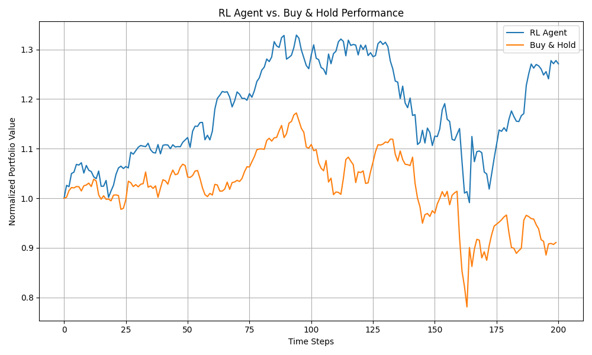

# RL Portfolio Trading Bot

A simple reinforcement learning project for portfolio management. This repository contains:

- **`fetch_data.py`**: Downloads historical adjusted-close price data for 15 well-known S&P 500 tickers (2018-01-01 to present) and saves cleaned `data.csv`.
- **`portfolio_env.py`**: Custom OpenAI Gym environment to simulate portfolio allocation over time with transaction costs.
- **`train.py`**: Trains a Soft Actor-Critic (SAC) agent on `PortfolioEnv`, with checkpointing and evaluation callbacks.
- **`evaluate.py`**: Evaluates a trained model on a hold-out test set and plots equity curves vs. a buy-and-hold benchmark and computing key performance metrics.
- **`.gitignore`**: Excludes Conda environments, caches, and temporary files.

## Prerequisites

- **Conda** (or Miniconda).
- **Python 3.9**.

## Setup

1. Create and activate the environment:
   ```bash
   conda create -n portfolio-rl python=3.9 -y
   conda activate portfolio-rl
   ```
2. Install required packages:
   ```bash
   pip install gym pandas numpy stable-baselines3 yfinance matplotlib shimmy
   ```

## Fetch Historical Data

Run the data-fetch script:

```bash
python fetch_data.py
```

- Generates `data.csv` with price history for selected tickers.
- Prints its shape and first few rows.

## Portfolio Environment

Load and test the custom Gym environment:

```bash
python - <<EOF
import pandas as pd
from portfolio_env import PortfolioEnv

prices = pd.read_csv("data.csv", index_col=0, parse_dates=True)
# 10-day window example
env = PortfolioEnv(prices, window_size=10)
env.reset()
EOF
```

### Smoke Test

Step through a few random actions:

```bash
python - <<EOF
import pandas as pd
from portfolio_env import PortfolioEnv

prices = pd.read_csv("data.csv", index_col=0, parse_dates=True)
env = PortfolioEnv(prices, window_size=10)
obs = env.reset()
for i in range(5):
    action = env.action_space.sample()
    obs, reward, done, info = env.step(action)
    print(f"Step {i+1}: Reward={reward:.4f}, Portfolio Value={info['portfolio_value']:.4f}")
    if done: break
EOF
```

If you see rewards and portfolio values printed without errors, the environment is working correctly.

## Training

Launch SAC training:

```bash
python train.py
```

- Checkpoints saved in `./models/` every 10k steps.
- Best model stored under `./models/best/`.
- Final model at `./models/sac_portfolio_final.zip`.

## Evaluation

After training, evaluate performance on a hold-out test set:

```bash
python evaluate.py
```

This script:
1. Loads the last ~250 trading days of `data.csv`.
2. Instantiates `PortfolioEnv` with a 50-day window.
3. Loads the best SAC model from `./models/best/best_model.zip`.
4. Rolls out a full episode, collecting portfolio values.
5. Computes and prints key metrics:
   - **Cumulative Return** (percentage gain over test period).
   - **Maximum Drawdown** (largest peak-to-trough drop).
   - **Volatility** (standard deviation of log returns).
6. Plots the RL agent’s equity curve versus a buy-and-hold baseline.

### Example Output

Cumulative Return: 27.11%  
Maximum Drawdown: 25.42%  
Volatility (std of log returns): 0.0190



**Interpretation:**

- The SAC agent achieved a 27% gain over the test window, while buy-and-hold lost ~10%.
- Although the agent experienced a 25% drawdown, it rebounded quickly, protecting downside relative to buy-and-hold.
- Volatility of ~1.9% per step indicates moderate risk-taking.

## Results & Analysis

1. **Early Outperformance (Steps 0–100)**  
   - Agent rises to ~1.30× normalized value vs. buy-and-hold ~1.15×, suggesting good asset rotation.  
2. **Mid‑Period Drawdown (Steps 100–160)**  
   - Drawdown from ~1.30× to ~1.10×; buy-and-hold fell deeper to ~0.98×. Agent protected capital better.  
3. **Recovery & Late‑Period Gains (Steps 160–200)**  
   - Strong rebound to ~1.27× vs. buy-and-hold stuck at ~0.90×. Agent re-entered appreciating assets faster.

**Key Metrics:**
- Cumulative Return: 27.11%  
- Maximum Drawdown: 25.42%  
- Volatility: 1.90%

## Project Structure

```text
├── fetch_data.py      # Data downloader
├── portfolio_env.py   # Gym environment
├── train.py           # Training script
├── evaluate.py        # Evaluation & analysis script
├── data.csv           # Downloaded price data
├── models/            # Checkpoints and saved models
├── logs/              # Evaluation logs
├── .gitignore
└── README.md          # This file
```
